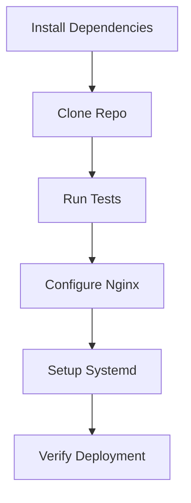

# Flask Application CI/CD Pipeline with Jenkins

 


## Table of Contents
1. [Overview](#overview)
2. [Prerequisites](#prerequisites)
3. [Pipeline Configuration](#pipeline-configuration)
4. [Stage Details](#stage-details)
5. [Post-Deployment](#post-deployment)
6. [Troubleshooting](#troubleshooting)


## Overview
Automated CI/CD pipeline that deploys Flask applications to EC2 with:
- Dependency management
- Automated testing
- Nginx reverse proxy
- Systemd service management
- Email notifications


### Jenkins Pipeline Script
    pipeline {   
    agent any
    environment {
        EC2_IP = '35.174.173.205'             // EC2 Public IP
        SSH_USER = 'ubuntu'                 // Default EC2 user
        APP_DIR = '/var/www/flaskapp'       // App install directory
        REPO_URL = 'https://github.com/vipulsaw/poc-python-cicd.git'  // Flask app Git repo
        EMAIL_RECIPIENTS = 'vipulsawale9@gmail.com'
    }
    
    stages {
        stage('Install Dependencies') {
            steps {
                sshagent(['vipul']) {
                    sh """
                        ssh -o StrictHostKeyChecking=no ${SSH_USER}@${EC2_IP} '
                            sudo apt update -y
                            sudo apt install -y python3 python3-pip python3-venv nginx python3-dev build-essential libssl-dev libffi-dev python3-full
                            
                            # Install gunicorn using apt (system package)
                            sudo apt install -y python3-gunicorn
                            
                            # Alternative: Install pipx for isolated Python applications
                            sudo apt install -y pipx
                            pipx ensurepath
                        '
                    """
                }
            }
        }
        
        stage('Clone Repository') {
            steps {
                sshagent(['vipul']) {
                    sh """
                        ssh ${SSH_USER}@${EC2_IP} "
                            sudo mkdir -p ${APP_DIR}
                            sudo chown -R ${SSH_USER}:${SSH_USER} ${APP_DIR}
                            
                            if [ -d ${APP_DIR}/.git ]; then
                                cd ${APP_DIR}
                                git pull
                            else
                                git clone ${REPO_URL} ${APP_DIR}
                            fi
                            
                            cd ${APP_DIR}
                            
                            # Create and activate virtual environment
                            python3 -m venv venv
                            . venv/bin/activate
                            
                            # Install requirements within venv
                            pip install --upgrade pip
                            pip install -r requirements.txt
                            
                            # Install gunicorn in venv if needed
                            pip install gunicorn
                        "
                    """
                }
            }
        }
        
        stage('Test Application') {
            steps {
                sshagent(['vipul']) {
                    sh """
                        ssh ${SSH_USER}@${EC2_IP} "
                            cd ${APP_DIR}
                            . venv/bin/activate
                            
                            # Install pytest if not already in requirements.txt
                            pip install pytest pytest-cov
                            
                            # Run pytest with coverage
                            echo 'Running tests...'
                            pytest -v --cov=app tests/
                            
                            # Fail the build if tests don't pass
                            if [ \$? -ne 0 ]; then
                                echo 'Tests failed!'
                                exit 1
                            fi
                        "
                    """
                }
            }
        }
        
        stage('Configure Nginx') {
            steps {
                sshagent(['vipul']) {
                    sh """
                        ssh ${SSH_USER}@${EC2_IP} '
                            echo "server {
                                listen 80;
                                server_name ${EC2_IP};
                                
                                location / {
                                    proxy_pass http://localhost:5000;
                                    proxy_set_header Host \\\$host;
                                    proxy_set_header X-Real-IP \\\$remote_addr;
                                    proxy_set_header X-Forwarded-For \\\$proxy_add_x_forwarded_for;
                                }
                                
                                location /static/ {
                                    alias ${APP_DIR}/static/;
                                    expires 30d;
                                }
                            }" | sudo tee /etc/nginx/sites-available/flaskapp
                            
                            sudo ln -sf /etc/nginx/sites-available/flaskapp /etc/nginx/sites-enabled
                            sudo rm -f /etc/nginx/sites-enabled/default
                            sudo nginx -t && sudo systemctl restart nginx
                        '
                    """
                }
            }
        }
        
        stage('Configure Systemd Service') {
            steps {
                sshagent(['vipul']) {
                    sh """
                        ssh ${SSH_USER}@${EC2_IP} '
                            echo "[Unit]
                            Description=Gunicorn Flask App
                            After=network.target
                            
                            [Service]
                            User=${SSH_USER}
                            Group=www-data
                            WorkingDirectory=${APP_DIR}
                            Environment=\"PATH=${APP_DIR}/venv/bin\"
                            ExecStart=${APP_DIR}/venv/bin/gunicorn --bind 0.0.0.0:5000 --workers 3 app:app
                            
                            [Install]
                            WantedBy=multi-user.target" | sudo tee /etc/systemd/system/flaskapp.service
                            
                            sudo systemctl daemon-reload
                            sudo systemctl enable flaskapp
                            sudo systemctl restart flaskapp
                        '
                    """
                }
            }
        }
        
        stage('Verify Deployment') {
            steps {
                sshagent(['vipul']) {
                    sh """
                        ssh ${SSH_USER}@${EC2_IP} '
                            sleep 5
                            sudo systemctl status flaskapp --no-pager
                            curl -I http://localhost:5000
                        '
                    """
                }
            }
        }
    }
    
    post {
        always {
            script {
                // This will run after every build, regardless of status
                emailext(
                    subject: "${currentBuild.result?:'SUCCESS'} - Job '${env.JOB_NAME} [${env.BUILD_NUMBER}]'",
                    body: """
                        <p>${currentBuild.result?:'SUCCESS'} - Job '${env.JOB_NAME} [${env.BUILD_NUMBER}]':</p>
                        <p>Check console output at <a href="${env.BUILD_URL}">${env.JOB_NAME} [${env.BUILD_NUMBER}]</a></p>
                        <p><strong>Build Status:</strong> ${currentBuild.result?:'SUCCESS'}</p>
                        <p><strong>Project:</strong> ${env.JOB_NAME}</p>
                        <p><strong>Build Number:</strong> ${env.BUILD_NUMBER}</p>
                        <p><strong>Build URL:</strong> <a href="${env.BUILD_URL}">${env.BUILD_URL}</a></p>
                        <p><strong>Deployment URL:</strong> <a href="http://${EC2_IP}">http://${EC2_IP}</a></p>
                        <p><strong>Duration:</strong> ${currentBuild.durationString}</p>
                    """,
                    to: EMAIL_RECIPIENTS,
                    recipientProviders: [[$class: 'DevelopersRecipientProvider']],
                    attachLog: true,
                    compressLog: true
                )
            }
        }
        
        success {
            echo "Flask app deployed successfully! Access at http://${EC2_IP}"
        }
        
        failure {
            echo "Deployment failed. Check logs."
        }
    }
}
```


